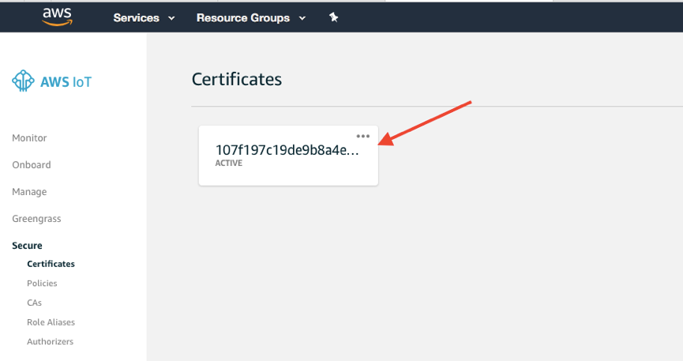
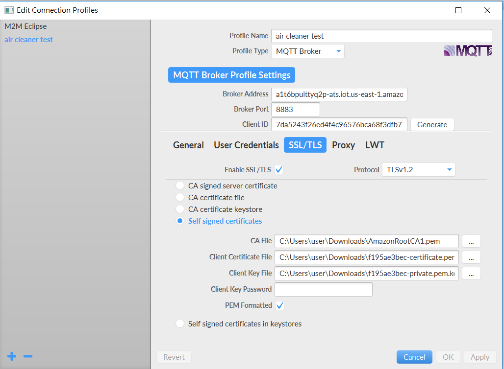

# Simulate Air Cleaner and using AWS IoT


[AWS IoT](https://aws.amazon.com/iot/) provides secure, bi-directional communication between Internet-connected devices such as sensors, actuators, embedded micro-controllers, or smart appliances and the AWS Cloud. This enables you to collect telemetry data from multiple devices, store and analyze the data. You can also create applications that enable your users to control these devices from their phones or tablets. 

## Scenario
In this scenario, we will use MQTT.fx to simulate an air cleaner. It will send some information such as power status to the AWS IoT platform. The information contains device ID, device type, device name, device status, air PM2.5 value, air quality. In AWS IoT platform, we will set some actions. First, we store the information in DynamoDB, second, when the PM2.5 value reaches the harmful level, AWS IoT will send a message to tell the device to turn on the power. In the same time, we also can send an email to tell the user that air is dirty, we will open the device automatically. When air PM2.5 value back to normal level, IoT send a message to tell the device to turn off the device.

<p align="center">
    
</p>


## Prerequisites
>The workshop’s region will be in ‘N.Virginia’

*    Sign-in an AWS account, and make sure you have select N.Virginia region. 
*    Download source file from GitHub.
*    Download MQTT.fx (1.6.0)：  http://mqttfx.jensd.de/index.php/download

<p align="center">
    
</p>


## Lab tutorial
### Create an IoT Type
1. Open AWS Manage Console and Sign in.

2. Click **IoT Device Management** under service.

3. Click **Types** under Manage at left navigation bar.

4. Click **Create**, and you will see **Create a thing type** page.

5. Type a name for the thing type.

6. Click **Create thing type**.


### Create an IoT Thing.

1. Click **Things** under Manage at left navigation bar.

2. Click **Register a thing**.

3. Click **Create a single thing**.

4. Type **air_cleaner_demo** for the thing name.

> Note: Make sure the thing name is correct because the following examples are based on this thing name.

5. In applying a type to this thing type section, select the type you create previously.

6. Let another settings default, click **Next**.

7. In add a certificate for your thing section, click **Create certificate**.

<p align="center">
    
</p>

8. As shown in the figure below, click **Download**. Meanwhile, a web page will pop out.

<p align="center">
    
</p>

9. In the popping web page, **right-click** **`Amazon Root CA 1`** -> **Save as a new file** to download root CA certificate. After downloading, you can close this web page.

<p align="center">
    
</p>

10. **Download** the following file and click **Activate**.

<p align="center">
    
</p>

11. Back to **Create a Thing** page and click **Attach a policy**.

12. Click **Register thing**.


### Create a Secure Policy and Attach on Certificate

1. Click **Secure** and click **Policies** at left navigation bar.

2. Click **Create a policy**.

3. Type a name for the policy.

4. In **Add Statements** section, type __`iot:*`__ in Action part, type __`*`__ in Resource ARN type.

<p align="center">
    
</p>

5. Check **Allow**, then click **Create**.

6. Click **Certificates** at left navigation bar.

7. Click the Certificate you create previously.

<p align="center">
    
</p>

8. Click **Actions**, then click **Attach policy**.

9. Select the policy you create previously, then click **Attach**.


### Add the Certificates to MQTT.fx and Test

1. Open MQTT.fx, when it asks you to update, click **No**.

2. Click the gear.

<p align="center">
    
</p>

3. Type a name for **Profile name**.

4. Go back to IoT thing, click the thing you create previously, then click **Interact**.

5. Copy the **endpoint**.
> Note: You can write down or copy the endpoint to a text file because it will be used in **Use Rule to trigger Open and Shutdown Device** step 10.

<p align="center">
    
</p>

6. Back to MQTT.fx, paste it to **Broker address**.

7. Type **8883** in **Broker Port**.

8. Click **Generate** to generate a Client ID.

9. Select **SSL/TLS**, select **Enable SSL/TLS**, then select **Self signed certificates**.

10. In **CA File**, choose **the CA file** which is a **.pem** file.

11. In **Client Certificate File**, choose the file which is a **.pem.crt** file.

12. In **Client Key File**, choose the file named with **private.pem.key** suffix.

13. Check **PEM Formatted**.

<p align="center">
    
</p>

14. Click **Apply** then click **OK**.

15. Click **Connect** to connect the AWS IoT platform.

16. Type **/test/topic** in the topic field, and copy below code and paste into the blank field:

```
    {
        "id": "12345678",
        "type": "air_cleaner",
        "name": "Demo",
        "power": "OFF",
        "pm": 1,
        "quality": "Green"
    }
```

<p align="center">
    
</p>

17. Back to AWS IoT platform, click **Test** at left navigation bar.

18. Type **/test/topic** in Subscription topic field, then click **Subscribe to topic**

19. Back to MQTT.fx, then click Publish, and you will see the message on the AWS IoT Platform.

<p align="center">
    
</p>

### Create a Rule to Save a Message in DynamoDB

1. In AWS IoT platform, click **Act** at left navigation bar.

2. Click **Create a rule**.

3. Type **Save_in_DynamoDB** as name and description.

4. Go back to MQTT.fx, type **device/aircleaner** as topic name.

5. Copy the [**air_cleaner.json**](https://github.com/ecloudvalley/Simulate-Air-Cleaner-and-using-AWS-IoT/blob/master/air_cleaner.json) code and paste to MQTT.fx, then click **Publish**.


6. Copy and paste the following SQL script into **Rule query statement**:
```
SELECT * FROM 'device/aircleaner'
```

>  The `device/aircleaner` must be the same as the topic of your IoT device. If you customize the topic name, please modify to ***\<YOUR-TOPIC-NAME\>***
.

<p align="center">
    
</p>

7. Click **Add action** in set one or more actions. 

8. Select **Insert a message into a DynamoDB table**, then click **Configure action**.

9. Click **Create a new resource**.

10. Click **Create table**.

11. Type **air_cleaner_message** as Table name.

12. Type **device_id** as Partition key, then click **Create**.

13. Back to IoT rule create page, click reload and choose **air_cleaner_message**.

14. Type **$id** as Partition key value.

15. Click **Create a new role**.

16. Type **IoT_save_DynamoDB** as role name, then click **Create a new role**.

17. Select the **IoT_save_DynamoDB** role, and click **Add action**. 

<p align="center">
    
</p>

18. Click **Create rule**.

19. Go back to MQTT.fx, then click **Publish** again.

20. Go back to DynamoDB page, and you will see the message save in the table.


### Send an Email when Air Quality reach a threshold

1. In AWS IoT Platform, click **Act**, then click **Create**.

2. Type **send_warning_email** as name.

3. Go to MQTT.fx, set pm value as **50**, and set quality as **RED**, then click **Publish**.

<p align="center">
    
</p>

4. Type the following SQL script into **Rule query statement**:

```
SELECT * FROM 'device/aircleaner' WHERE pm = 50
```

>  The `device/aircleaner` must be the same as the topic of your IoT device. If you customize the topic name, please modify to ***\<YOUR-TOPIC-NAME\>***
.

<p align="center">
    
</p>

5. Click **Add action** in set one or more actions.

6. Select **Invoke a Lambda function passing the message data**, then click **Configure action**.

7. Click **Create a new Lambda function**.

8. Type **Airwarning** as Lambda name.

9. Select **Create a custom role**.

10. Click **View policy document**, then click **Edit**, when warning pumps out, click **OK**.

11. Copy below code and paste it into the policy document, then click **Allow**.

```
    {
          "Version": "2012-10-17",
          "Statement": [
            {
                  "Effect": "Allow",
                 "Action": [
                    "logs:CreateLogGroup",
                    "logs:CreateLogStream",
                    "logs:PutLogEvents"
                  ],
                  "Resource": "arn:aws:logs:*:*:*"
            },
            {
                  "Effect": "Allow",
                  "Action": "sns:*",
                  "Resource": "arn:aws:sns:*:*:*"
            }
          ]
    }
```

12. Click **Create function**.

13. Copy [**air_quality_harmful.js**](https://github.com/ecloudvalley/Simulate-Air-Cleaner-and-using-AWS-IoT/blob/master/air_quality_harmful.js) code, and paste it into Lambda code field.

14. In **Environment variables** section, type **email** as key, type your email as value, then click **Save**.

15. Back to IoT rule create page, click refresh and select **Airwarning**, then click **Add action**.

<p align="center">
    
</p>

16. Click **Create rule**.

17. Go back to MQTT.fx, then click **Publish** again.

18. You will receive an email that contains device name, pm value, and air quality level.

### Use Rule to trigger Open and Shutdown Device

1. At IoT **Act** page, click **send_warning_email**.

2. Click **Add action**, then click **Invoke a Lambda function passing the message data**, then click **Configure action**.

3. Click **Create a new lambda function**.

4. Type **OpenDevice** as Lambda name.

5. Click **Create a custom role**.

6. Select **Create a new IAM Role** as IAM Role.

7. Type **Lambda_send_mqtt** as Role name.

8. Click View policy document, then click Edit, when warning pumps out, click OK.

```
    {
          "Version": "2012-10-17",
          "Statement": [
            {
                  "Effect": "Allow",
                  "Action": [
                    "logs:CreateLogGroup",
                    "logs:CreateLogStream",
                    "logs:PutLogEvents"
                  ],
                  "Resource": "arn:aws:logs:*:*:*"
            },
               {
                  "Effect": "Allow",
                  "Action": "iot:*",
                  "Resource": "arn:aws:iot:*:*:*"
               }
        ]
    }
```

9. After creating the lambda function, copy the [**deviceON.js**](https://github.com/ecloudvalley/Simulate-Air-Cleaner-and-using-AWS-IoT/blob/master/deviceON.js) code and paste it to the Lambda code field, then save.

10. Remember to **replace your endpoint** with the **end point** in Add the Certificates to MQTT.fx and Test step 5 and click save.

<p align="center">
    
</p>

11. Back to Rule creation page, click refresh and select **OpenDevice**, then click **Add action**.

12. Now Back to your IoT thing, click your thing, and click **Shadow**.

13. You can see there is no shadow for the device, so we need to create one.

14. Back to MQTT.fx, type **$aws/things/air_cleaner_demo/shadow/update** as topic name.

15. Copy below code and paste it into the field. This action tries to report the air cleaner current status to shadow engine.

```
    {
        "state": {
            "reported": {
                "power": "OFF"
            }
        }
    }
```

<p align="center">
    
</p>

16. Click **Publish**, then go back to the IoT platform. You will see the shadow changes.

<p align="center">
    
</p>

17. Now let try to trigger the rule to open device automatically. Go back MQTT.fx, type **device/aircleaner**.

18. Copy below code to MQTT.fx, and change the pm value to **50**, air quality to **RED**.

```
    {
        "id": "12345678",
        "type": "air_cleaner",
        "name": "Demo",
        "power": "OFF",
        "pm": 1,
        "quality": "Green"
    }
```

19. Now **Publish** it, you should receive a warning email, and go back to see the thing shadow, it should have the desired state.

<p align="center">
    
</p>

20. Go back to **Act** page, then click **Create**.

21. Type **Device_Auto_OFF** as the name.

22. Back to MQTT.fx, type **device/aircleaner** and change the pm value to **20**, power to **ON**, and air quality to **GREEN**, then **Publish**.

23. Type the following SQL script into **Rule query statement**:
```
SELECT * FROM 'device/aircleaner' WHERE pm = 20 AND power = "ON"
```

>  The `device/aircleaner` must be the same as the topic of your IoT device. If you customize the topic name, please modify to ***\<YOUR-TOPIC-NAME\>***
.

24. Click Add action, click **Invoke a Lambda function passing the message data**, then click **Configure action**.

25. Click **Create a new lambda function**.

26. Type **ShutdownDevice** as name.

27. Select **Choose an existing role** as Role.

28. Select **Lambda_send_mqtt** as Existing role, then Click **Create function**.

29. Copy the [**deviceOFF.js**](https://github.com/ecloudvalley/Simulate-Air-Cleaner-and-using-AWS-IoT/blob/master/deviceOFF.js) code and paste it to the Lambda code field.

30. Remember to change your endpoint.

31. Click **Save**, and back to rule page, click reload and select **ShutdownDevice**, then click **Add action**.

32. Click **Create rule**.

33. Go bck to MQTT.fx, then click **Publish** again.

34. You can go back the thing shadow to see the desired state is changed to OFF.

<p align="center">
    
</p>

### Use Scripts to test all workflow

1. In MQTT.fx, click **Scripts** then click **Edit**.

2. Copy [**air_cleaner_test.js**](https://github.com/ecloudvalley/Simulate-Air-Cleaner-and-using-AWS-IoT/blob/master/Air_cleaner_test.js) code and paste it to switch_fountain_test.js, save and close it.

3. Now you can click **Execute** to see how shadow change, and the workflow. The scripts will let MQTT.fx send a message every second.

## Clean Up

To delete the AWS resources, perform the tasks below in order:
* Delete Thing, Thing Type, Certificates, Policies, and Act Roles in AWS Iot.
* Delete "Airwarning", "OpenDevice", "ShutdownDevice" functions in Lambda Functions.
* Delete AWS IAM Roles "IoT_save_DynamoDB" and "Lambda_send_mqtt".
* Delete "air_cleaner_message" table in AWS DynamoDB.

## Conclusion

Congratulations! You now have learned how to:
* How to register a device as a thing.
* Using Rule Engine to trigger other AWS service.
* Using Shadow Engine to update device states.


